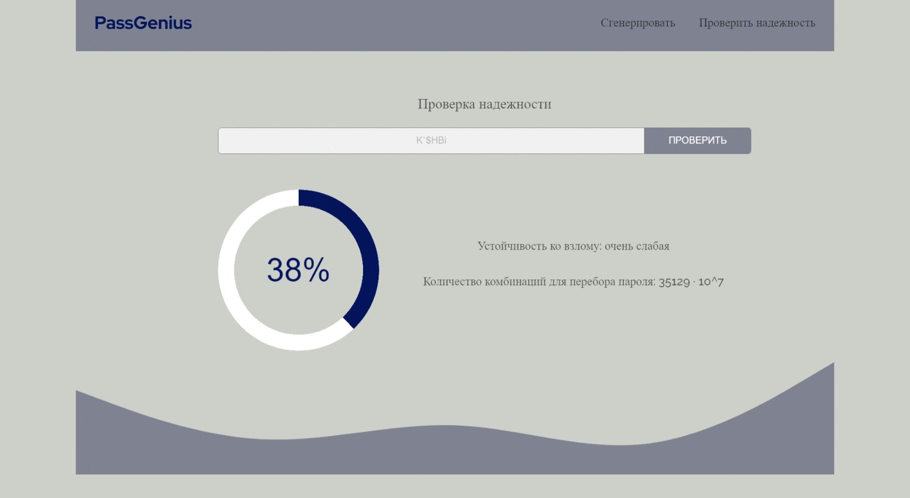

# PassGenius

## Table of Contents


  - [Deployment](#deployment)
  - [Introduction](#introduction)
  - [Showcase](#showcase)


## Introduction

This site is used to generate and verify a password. 4 dictionaries are available for generation, these are uppercase and lowercase letters, numbers and special characters.

## Showcase



 
## Deployment

The first step is to clone the command line project.

``` Bash
git clone https://github.com/stemirkhan/SmartSense.git
```

At the end, it remains to run the docker containers with the command:

``` Bash
docker-compose -f docker-compose.prod.yml up --build
```
